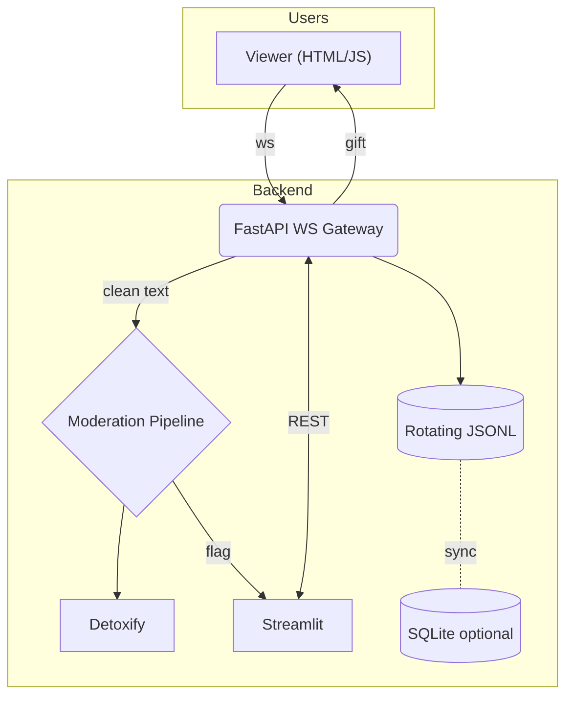

# SafeStream — A Real‑Time Moderated Live‑Chat Simulator

> **Purpose**  Provide a concise, production‑ready reference for building a TikTok‑style live‑stream chat with built‑in toxicity moderation, simulated gifts, and a moderator dashboard. The project is intentionally lean, yet scalable to \~500 messages ⁄ second on a single container.

---

## 1. Feature Summary

| Area       | Capability                                                       |
| ---------- | ---------------------------------------------------------------- |
| Real‑time  | WebSockets over FastAPI + Uvicorn                                |
| Moderation | Detoxify (plug‑in interface for any `text-classification` model) |
| Dual UI    | Vanilla HTML/JS client • Streamlit moderator dashboard           |
| Events     | Random or API‑triggered gift events                              |
| Storage    | In‑memory queue • JSONL logs • optional SQLite                   |
| DevOps     | Docker + Compose • GitHub Actions CI • Locust load tests         |

---

## 2. Why This Stack? (Critique & Justification)

| Decision                | Pros                                                 | Cons                                             | Alternatives                                            |
| ----------------------- | ---------------------------------------------------- | ------------------------------------------------ | ------------------------------------------------------- |
| **Python 3.12**         | Widely known; rich ML ecosystem; async support       | Slightly slower than Go/Rust at high concurrency | Go (net/http), Rust (axum), Node.js (fast)              |
| **FastAPI + Uvicorn**   | First‑class async, OpenAPI docs, minimal boilerplate | Native WebSocket is basic (no rooms/channels)    | Starlette directly, Quart, Socket.IO (extra RTT)       |
| **Detoxify**            | Small, pre‑trained, fast CPU inference               | English‑centric, no incremental training         | Perspective API (external calls), custom fine‑tune BERT |
| **Vanilla HTML/JS**     | Zero build tooling, immediate demo                   | Not reactive; no TypeScript types                | React/Vite, SvelteKit                                   |
| **Streamlit**           | 1‑file dashboards, no JS                             | Limited theming, heavier process                 | Dash, Panel, plain React admin                         |
| **JSONL logs + SQLite** | Human‑readable, minimal ops                          | No HA, memory bound                              | PostgreSQL, Redis Streams                               |
| **Docker/Compose**      | Single‑command setup, cross‑platform                 | Adds slight build overhead                       | Nix, Podman                                             |
| **Locust**              | Simple Python load scripts                           | Requires separate worker processes               | k6 (JS), Vegeta                                        |

*The choices above aim for maximum ****developer velocity**** while staying close to TikTok's production reality: Python ML services behind a thin realtime gateway.*

---

## 3. Architecture



---

## 4. Quick‑Start

### Local (venv)

```bash
python -m venv .venv && source .venv/bin/activate
pip install -e ".[dev]"  # installs httpx + lint / test tools
uvicorn safestream.app.main:app --reload  # :8000
streamlit run dashboard/app.py            # :8501
```

### Docker Compose

```bash
docker compose up --build
```

*Swagger UI:* `http://localhost:8000/docs`   *Viewer:* `http://localhost:8000/chat`   *Dashboard:* `http://localhost:8501`

---

## 5. Configuration

| Var               | Default | Purpose                          |
| ----------------- | ------- | -------------------------------- |
| `APP_PORT`        | 8000    | FastAPI + WS                     |
| `DASH_PORT`       | 8501    | Streamlit                        |
| `GIFT_RATE_SEC`   | 15      | Avg seconds between random gifts |
| `TOXIC_THRESHOLD` | 0.6     | Detoxify flag limit              |
| `DISABLE_DETOXIFY`| 0       | Set to "1" to use stub mode      |

---

## 6. API / Protocol

### WebSocket `/ws/{username}`

*Client → Server*

```json
{"type":"chat","message":"hello"}
```

*Server → Clients*

```json
{"type":"chat","user":"alice","message":"hello","toxic":false,"score":0.02,"ts":"2025‑06‑26T12:34:56Z"}
```

### Gift HTTP

```bash
POST /api/gift  {"from":"admin","gift_id":999,"amount":1}
```

---

## 7. Machine‑Learning Moderation

*Detoxify is loaded once at startup; predictions run on CPU in <10 ms for typical messages.* `moderation.py` exposes a single async `predict(text)` coroutine so any Hugging Face model can be swapped by changing an env var.

*Fine‑tuning* — see `research/fine_tune.ipynb` for optional Jigsaw training; not required for MVP.

---

## 8. Logging & Persistence

- Every message and moderation decision is appended to `logs/chat_YYYY‑MM‑DD.jsonl` (rotated at 10 MiB ×10 files).
- Set `SQLITE_URL=` to persist into SQLite via SQLAlchemy models (`messages` • `flags`).

---

## 9. Testing & Load

```bash
pytest -q             # unit + WebSocket E2E
locust -f load/locustfile.py  # open :8089 UI
```

The default Locust script ramps to 200 users/500 msg·s⁻¹; adjust via env.

---

## 10. CI / CD

GitHub Actions pipeline:

1. **Setup** Python 3.12, cache pip.
2. **Lint** `ruff` • **Format‑check** `black`.
3. **Test** `pytest`.
4. **Build** Docker and optionally push to GHCR.

---

## 11. Stretch Goals

- JWT‑secured WebSocket connect (`Authorization: Bearer …`).
- Leaky‑bucket rate‑limiting middleware.
- Language detection + translation before moderation (i18n).
- Postgres + Alembic migrations.
- Helm chart for Kubernetes.

---

## 12. Project Layout

```
├── app/             # FastAPI backend
│   ├── main.py
│   ├── moderation.py
│   ├── events.py
│   ├── schemas.py
│   └── db.py
├── dashboard/       # Streamlit
│   └── app.py
├── frontend/        # Static HTML/JS
│   └── index.html
├── tests/
├── load/
├── Dockerfile
├── docker-compose.yml
└── README.md
```

---

## 13. High‑Level Build Guide (for an LLM)

**Step 1 — Project Skeleton**\
Create the directories/files shown above. Initialise `pyproject.toml` or `requirements.txt` with FastAPI, Uvicorn, Detoxify, Streamlit, SQLAlchemy, pytest, Locust.

**Step 2 — Backend Entry‑Point**\
Implement `app/main.py` with FastAPI and a WebSocket route `/ws/{username}`. Store connected sockets in an in‑memory list.

**Step 3 — Moderation Pipeline**\
In `app/moderation.py`, load Detoxify at startup and expose `async def predict(text:str)->Tuple[bool,float]`.\
Call this function for every incoming chat message; attach `toxic` + `score` to the outbound payload.

**Step 4 — Gift Simulation**\
`events.py` should spawn an asyncio task that sleeps `GIFT_RATE_SEC±rand` seconds, then broadcasts a gift JSON to all sockets. Also expose `POST /api/gift` to trigger manually.

**Step 5 — Logging**\
Configure a `RotatingFileHandler` pointing to `logs/`. Log every inbound/outbound message as JSON. If `SQLITE_URL` is set, initialise SQLAlchemy models and write the same data to the DB.

**Step 6 — Frontend Client**\
`frontend/index.html` connects via WebSocket, renders messages in a scrollable div, colours toxic messages red, and animates gift events.

**Step 7 — Moderator Dashboard**\
`dashboard/app.py` uses Streamlit to stream the JSONL log (tail ‑f style) and plot the rolling toxic‑message ratio. Provide buttons to trigger gifts or disconnect abusive users.

**Step 8 — Tests & Load**\
Write `tests/test_ws.py` using FastAPI's `TestClient` to ensure moderation flags >90 % of synthetic toxic messages. Create `load/locustfile.py` to simulate 200 users with a think‑time of 0.5 s.

**Step 9 — Dockerise**\
Add a multi‑stage `Dockerfile` (python -slim) and a `docker-compose.yml` with two services: `api` (ports 8000) and `dash` (ports 8501).

**Step 10 — CI/CD**\
Create `.github/workflows/ci.yml` performing lint, test, and Docker build. Push on tag ⇒ publish image to GHCR.

**Step 11 — Stretch Enhancements**\
Iteratively add JWT auth, rate limiting, i18n, and a Postgres service. Update docs, diagrams, and tests accordingly.

---

## 14. License

MIT — see `LICENSE`.

## Development Tools and Code Quality

- **Black**: The only code formatter used for Python files (enforced via pre-commit and CI)
- **Ruff**: Used for linting and import sorting only (not for formatting)

Pre-commit hooks and CI will run Black for formatting and Ruff for linting. Do not use Ruff for formatting (ruff-format is disabled).

