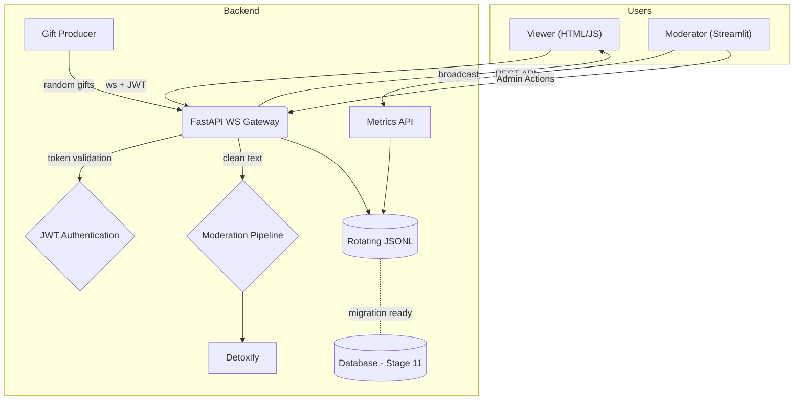

# SafeStream — A Real‑Time Moderated Live‑Chat Simulator

> **Purpose**  Provide a concise, production‑ready reference for building a TikTok‑style live‑stream chat with built‑in toxicity moderation, simulated gifts, JWT authentication, and a comprehensive moderator dashboard. The project is intentionally lean, yet scalable to \~500 messages ⁄ second on a single container.

---

## 1. Feature Summary

| Area       | Capability                                                       |
| ---------- | ---------------------------------------------------------------- |
| Real‑time  | WebSockets over FastAPI + Uvicorn with JWT authentication        |
| Auth       | Complete JWT authentication with bcrypt password hashing         |
| Moderation | Detoxify (plug‑in interface for any `text-classification` model) |
| Dual UI    | Vanilla HTML/JS client with animated gift badges • Full-featured Streamlit moderator dashboard |
| Events     | Automated random gift producer + API‑triggered gift events      |
| Storage    | In‑memory queue • JSONL logs • Database integration ready (Stage 11) |
| DevOps     | Docker + Compose • GitHub Actions CI • Locust load tests         |

---

## 2. Why This Stack? (Critique & Justification)

| Decision                | Pros                                                 | Cons                                             | Alternatives                                            |
| ----------------------- | ---------------------------------------------------- | ------------------------------------------------ | ------------------------------------------------------- |
| **Python 3.12**         | Widely known; rich ML ecosystem; async support       | Slightly slower than Go/Rust at high concurrency | Go (net/http), Rust (axum), Node.js (fast)              |
| **FastAPI + Uvicorn**   | First‑class async, OpenAPI docs, minimal boilerplate | Native WebSocket is basic (no rooms/channels)    | Starlette directly, Quart, Socket.IO (extra RTT)       |
| **Detoxify**            | Small, pre‑trained, fast CPU inference               | English‑centric, no incremental training         | Perspective API (external calls), custom fine‑tune BERT |
| **Vanilla HTML/JS**     | Zero build tooling, immediate demo                   | Not reactive; no TypeScript types                | React/Vite, SvelteKit                                   |
| **Streamlit**           | Rich dashboards with real-time updates, minimal code | Limited theming, heavier process                 | Dash, Panel, plain React admin                         |
| **JSONL logs + SQLite** | Human‑readable, minimal ops, database ready          | No HA, memory bound (transitioning to DB)       | PostgreSQL, Redis Streams                               |
| **Docker/Compose**      | Single‑command setup, cross‑platform                 | Adds slight build overhead                       | Nix, Podman                                             |
| **Locust**              | Simple Python load scripts                           | Requires separate worker processes               | k6 (JS), Vegeta                                        |

*The choices above aim for maximum ****developer velocity**** while staying close to TikTok's production reality: Python ML services behind a thin realtime gateway.*

---

## 3. Architecture



---

## 4. Quick‑Start

### Local (venv)

```bash
python -m venv .venv && source .venv/bin/activate
pip install -e ".[dev,ml,dash]"  # installs all dependencies
uvicorn app.main:app --reload    # Backend :8000
streamlit run dashboard/app.py   # Dashboard :8501
```

### Docker Compose

```bash
docker compose up --build
```

**Access Points:**
- *Backend API:* `http://localhost:8000/docs` (Swagger UI)
- *Chat Client:* `http://localhost:8000/chat` (Live chat interface)
- *Moderator Dashboard:* `http://localhost:8501` (Real-time monitoring)

---

## 5. Authentication System

SafeStream includes a complete JWT authentication system with secure user management:

### Features
- **User Registration & Login**: Secure account creation with email support
- **JWT Tokens**: Stateless authentication with configurable expiry (default: 30 minutes)
- **Password Security**: bcrypt hashing with automatic salt generation
- **Protected Endpoints**: All WebSocket connections and admin actions require authentication
- **User Management**: JSON-based user storage (migrating to database in Stage 11)

### Usage Examples

**Register a new user:**
```bash
curl -X POST http://localhost:8000/auth/register \
  -H "Content-Type: application/json" \
  -d '{"username":"alice","password":"secret123","email":"alice@example.com"}'
```

**Login and get JWT token:**
```bash
curl -X POST http://localhost:8000/auth/login \
  -H "Content-Type: application/x-www-form-urlencoded" \
  -d "username=alice&password=secret123"
```

**Access protected WebSocket:**
```javascript
const token = "your_jwt_token_here";
const ws = new WebSocket(`ws://localhost:8000/ws/alice?token=${token}`);
```

### Demo Accounts
The system includes pre-configured demo accounts for testing:
- `demo_user` / `demo123`
- `test_streamer` / `test456`
- `chat_viewer` / `viewer789`

---

## 6. Moderator Dashboard

SafeStream includes a comprehensive moderator dashboard built with Streamlit for real-time monitoring, moderation, and analytics.

### Features
- **Real-time Data Sources**: Database (ready for Stage 11), JSONL log tailing, or metrics API polling
- **Live Metrics**: Viewer count, total gifts, toxicity percentage with auto-refresh
- **Message Management**: Recent messages table with filtering by username and toxicity
- **Analytics Visualizations**: 
  - Rolling toxicity percentage over time
  - Top gifters leaderboard
  - Message volume trends
- **Admin Actions**: Kick users, mute users, reset metrics (requires authentication)
- **Custom Theming**: Dark mode with TikTok-style pink accents (#ff0050)
- **Performance Optimized**: Smart scrolling, message opacity gradients, focus preservation

### Dashboard Access
```bash
# Start the dashboard (requires backend running)
streamlit run dashboard/app.py

# Access dashboard
open http://localhost:8501
```

### Admin API Endpoints
All admin endpoints require JWT authentication via `Authorization: Bearer <token>` header:

- `POST /api/admin/kick` - Remove user from chat
- `POST /api/admin/mute` - Mute user for 5 minutes  
- `POST /api/admin/reset_metrics` - Reset all metrics counters
- `POST /api/gift` - Manually trigger gift events

---

## 7. Configuration

| Variable              | Default | Purpose                          |
| --------------------- | ------- | -------------------------------- |
| `JWT_SECRET_KEY`      | `your-secret-key-change-in-production` | JWT signing secret |
| `JWT_EXPIRE_MINUTES`  | 30      | JWT token expiry time           |
| `SAFESTREAM_USERS_FILE` | `users.json` | User storage file path    |
| `APP_PORT`            | 8000    | FastAPI + WebSocket server      |
| `DASH_PORT`           | 8501    | Streamlit dashboard             |
| `GIFT_INTERVAL_SECS`  | 15      | Seconds between random gifts    |
| `TOXIC_THRESHOLD`     | 0.6     | Detoxify toxicity flag limit    |
| `DISABLE_DETOXIFY`    | 0       | Set to "1" to use stub mode     |
| `MAX_CONNECTIONS`     | 1000    | Maximum WebSocket connections   |
| `MAX_USERNAME_LENGTH` | 50      | Maximum username length         |
| `CLEANUP_INTERVAL`    | 300     | Connection cleanup interval (seconds) |

### Database Configuration (Stage 11)
```bash
# Database settings for upcoming database integration
DATABASE_URL=sqlite+aiosqlite:///data/safestream.db
DATABASE_ECHO=false
DATABASE_POOL_SIZE=5
DATABASE_MAX_OVERFLOW=10
```

---

## 8. API / Protocol

### Authentication Endpoints

**Register new user:**
```bash
POST /auth/register
Content-Type: application/json
{"username":"alice","password":"secret","email":"alice@example.com"}
```

**Login (OAuth2 form):**
```bash
POST /auth/login
Content-Type: application/x-www-form-urlencoded
username=alice&password=secret
```

**Get user info (protected):**
```bash
GET /auth/me
Authorization: Bearer <jwt_token>
```

### WebSocket Chat `/ws/{username}?token=<jwt_token>`

**Client → Server:**
```json
{"type":"chat","message":"hello"}
```

**Server → Clients:**
```json
{"type":"chat","user":"alice","message":"hello","toxic":false,"score":0.02,"ts":"2025‑06‑26T12:34:56Z"}
```

### Gift Events

**Manual gift trigger:**
```bash
POST /api/gift
Content-Type: application/json
{"from":"admin","gift_id":999,"amount":1}
```

**Gift broadcast (auto/manual):**
```json
{"type":"gift","from":"bot","gift_id":123,"amount":5,"ts":"2025‑06‑26T12:34:56Z"}
```

### Admin Endpoints (require JWT authentication)

```bash
POST /api/admin/kick         {"username":"bob"}
POST /api/admin/mute         {"username":"bob"}  
POST /api/admin/reset_metrics  {}
```

### Metrics API

```bash
GET /metrics
# Returns: {"viewer_count": 5, "gift_count": 42, "toxic_pct": 12.5}
```

---

## 9. Machine‑Learning Moderation

*Detoxify is loaded once at startup; predictions run on CPU in <10 ms for typical messages.* `moderation.py` exposes a single async `predict(text)` coroutine so any Hugging Face model can be swapped by changing an env var.

### Features
- **Real-time Processing**: Sub-10ms toxicity detection per message
- **Configurable Threshold**: Adjust `TOXIC_THRESHOLD` for sensitivity
- **Fallback Mode**: Set `DISABLE_DETOXIFY=1` for development without ML dependencies
- **Extensible**: Plugin interface for any text classification model

*Fine‑tuning* — see `research/fine_tune.ipynb` for optional Jigsaw training; not required for MVP.

---

## 10. Logging & Persistence

### Current Implementation
- **JSONL Logs**: Every message and moderation decision appended to `logs/chat_YYYY‑MM‑DD.jsonl`
- **Log Rotation**: 10 MiB files with 10 backup files using RotatingFileHandler
- **Structured Data**: All events logged in JSON format matching API protocols
- **Dashboard Integration**: Real-time log tailing for dashboard updates

### Database Integration (Stage 11 - Ready for Implementation)
- **SQLAlchemy Models**: User, Message, GiftEvent, AdminAction tables designed
- **Async Support**: Full async/await database operations with connection pooling
- **Migration Strategy**: Dual storage (JSONL + DB) during transition
- **Data Preservation**: Complete migration scripts for existing JSONL data

See `DevelopmentVerification/Step11.md` for detailed database implementation plan.

---

## 11. Testing & Load

```bash
# Run full test suite (102 tests including JWT auth)
pytest -q

# Run specific test categories
pytest tests/test_auth.py -v      # JWT authentication tests
pytest tests/test_ws_basic.py -v  # WebSocket integration tests
pytest tests/test_gift.py -v      # Gift event tests

# Load testing with Locust
locust -f load/locustfile.py      # Open :8089 UI for load testing
```

**Test Coverage:**
- **Authentication**: 29 comprehensive JWT tests
- **WebSocket**: Real-time chat with moderation
- **Gift Events**: Manual and automated gift broadcasting
- **Admin Actions**: Protected endpoint testing
- **Integration**: End-to-end message flow validation

The default Locust script ramps to 200 users/500 msg·s⁻¹; adjust via environment variables.

---

## 12. CI / CD

GitHub Actions pipeline runs on every push and PR:

1. **Setup** Python 3.12, cache dependencies
2. **Code Quality** `black --check` • `ruff check` • `mypy`
3. **Testing** Full pytest suite with coverage
4. **Docker Build** Multi-stage container build
5. **Security** Dependency vulnerability scanning

**Quality Gates:**
- All tests must pass (102 tests)
- Code coverage > 80%
- No linting errors
- Security scan passes

---

## 13. Development Roadmap

### ✅ Completed Stages
- **Stage 1-4**: Core WebSocket chat with moderation
- **Stage 5**: Gift API and event broadcasting  
- **Stage 6**: Random gift producer with background tasks
- **Stage 7**: ML moderation with Detoxify integration
- **Stage 8**: Load testing and performance optimization
- **Stage 9**: Streamlit dashboard with real-time monitoring
- **Stage 10**: Complete JWT authentication system

### 🚧 Current Stage
- **Stage 11**: Database Integration (Implementation ready)
  - SQLAlchemy models and async operations
  - Migration from JSONL to database storage
  - Dashboard database integration with fallback
  - User authentication database migration

### 🔮 Future Stages
- **Stage 12**: Advanced Analytics & Reporting
- **Stage 13**: Real-time Dashboard Updates (WebSocket)
- **Stage 14**: Message Search & Advanced Filtering
- **Stage 15**: Production Deployment & Scaling

---

## 14. Project Layout

```
SafeStream/
├── app/                            # FastAPI back-end package
│   ├── __init__.py
│   ├── main.py                     # FastAPI app with WebSocket + auth endpoints
│   ├── auth.py                     # JWT authentication system
│   ├── moderation.py               # Detoxify ML integration
│   ├── events.py                   # Gift producer and broadcasting
│   ├── schemas.py                  # Pydantic models for all APIs
│   ├── metrics.py                  # Live metrics tracking
│   └── db.py                       # Database models (Stage 11 ready)
│
├── dashboard/                      # Streamlit moderator dashboard
│   └── app.py                      # Full-featured dashboard with admin actions
│
├── static/                         # Static assets served at /static
│   ├── index.html                  # TikTok-style chat client (mobile-optimized)
│   ├── css/
│   │   └── styles.css              # Dark theme + animated effects
│   └── js/
│       └── main.js                 # WebSocket client with JWT auth
│
├── tests/                          # Comprehensive test suite (102 tests)
│   ├── __init__.py
│   ├── conftest.py                 # Test configuration and fixtures
│   ├── test_auth.py                # JWT authentication tests (29 tests)
│   ├── test_ws_basic.py            # WebSocket integration tests
│   ├── test_gift.py                # Gift event tests
│   ├── test_random_gift.py         # Background gift producer tests
│   ├── test_moderation.py          # ML moderation pipeline tests
│   ├── test_events.py              # Event broadcasting tests
│   └── test_*.py                   # Additional test modules
│
├── DevelopmentVerification/        # Stage-by-stage verification scripts
│   ├── Step1.md - Step11.md        # Detailed implementation documentation
│   ├── Step1.bash - Step10.bash    # Automated verification scripts
│   └── all_verifications.sh        # Run all verification tests
│
├── docs/                           # Project documentation
│   └── DEV_SETUP.md               # Development setup guide
│
├── load/                           # Locust load testing
│   └── locustfile.py              # 200 user / 500 msg/s load test
│
├── logs/                           # Rotating JSONL logs (git-ignored)
│   └── .gitkeep
│
├── scripts/                        # Utility scripts
│   ├── migrate_users.py            # User migration script (Stage 11)
│   ├── migrate_jsonl.py            # JSONL to database migration (Stage 11)
│   └── test-ci.sh                  # CI pipeline simulation
│
├── Dockerfile                      # Multi-stage production container
├── docker-compose.yml              # Full stack with dashboard
├── .pre-commit-config.yaml         # Code quality hooks
├── pyproject.toml                  # Modern Python packaging (PEP 621)
├── README.md                       # This file
└── LICENSE                         # MIT license
```

---

## 15. High‑Level Build Guide (for an LLM)

**Stage 1-2 — Project Foundation**\
✅ Create project skeleton with modern Python packaging (`pyproject.toml`). Initialize FastAPI app with WebSocket route `/ws/{username}` and in-memory connection management.

**Stage 3-4 — Core Chat System**\
✅ Implement moderation pipeline with Detoxify integration. Add message validation, toxicity scoring, and real-time broadcasting to all connected clients.

**Stage 5-6 — Gift System**\
✅ Add gift API endpoint and automated gift producer. Implement background asyncio tasks for random gift generation with configurable intervals.

**Stage 7-8 — ML & Performance**\
✅ Integrate Detoxify ML model with async prediction pipeline. Add comprehensive load testing with Locust (200 users, 500 msg/s target).

**Stage 9 — Dashboard**\
✅ Build full-featured Streamlit dashboard with real-time metrics, message filtering, admin actions, and analytics visualizations.

**Stage 10 — Authentication**\
✅ Implement complete JWT authentication system with user registration, login, protected WebSocket connections, and admin endpoint security.

**Stage 11 — Database Integration** (Implementation Ready)\
🚧 Migrate from file-based storage to SQLAlchemy database. Implement dual storage strategy, user migration, and dashboard database integration.

**Stage 12+ — Advanced Features**\
🔮 Add advanced analytics, real-time dashboard updates, message search, and production deployment configurations.

---

## 16. Development Tools and Code Quality

### Code Formatting & Linting
- **Black**: Primary code formatter (line-length: 88, target: Python 3.13)
- **Ruff**: Linting and import sorting (not used for formatting)
- **MyPy**: Type checking for improved code safety
- **Pre-commit**: Automated code quality hooks

### Testing Framework
- **Pytest**: Comprehensive test suite with async support
- **Test Coverage**: >80% coverage requirement
- **Integration Tests**: WebSocket, authentication, and end-to-end flows
- **Load Testing**: Locust-based performance validation

### Development Workflow
```bash
# Install with all development dependencies
pip install -e ".[dev,ml,dash]"

# Run code quality checks
pre-commit run --all-files

# Run tests with coverage
pytest --cov=app --cov-report=html

# Start development servers
uvicorn app.main:app --reload      # Backend with hot reload
streamlit run dashboard/app.py     # Dashboard with auto-refresh
```

---

## 17. License

MIT — see `LICENSE`.

---

**🚀 Ready for Production**: SafeStream provides a complete, tested, and documented foundation for building real-time moderated chat applications with modern Python best practices, comprehensive authentication, and production-ready monitoring capabilities.
